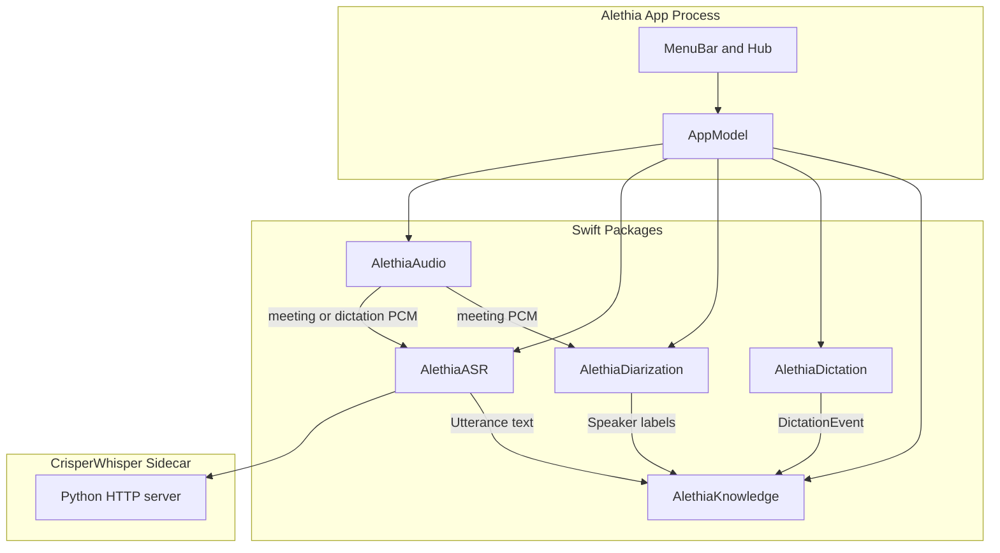

# Alethia Architecture

## Goals

1. Explicit meeting recording that captures mic (+ optional system audio) only while the user is recording.
2. Push-to-talk dictation (hold **Fn**) that types into any app and stores what was typed.
3. Persistent speaker identity that improves as the user names people.
4. Fully local — no audio or transcripts leave the device.

## Process topology

## Dual-mode audio policy

| Mode | Trigger | Capture | Downstream |
|------|---------|---------|------------|
| Meeting | Menu **Start / Stop Meeting Recording** | Mic (+ optional system audio) while recording | On stop → CrisperWhisper (verbatim) + diarization → SQLite |
| Dictation | Hold **Fn** / release | Mic-only (or shared meeting stream if already recording) | CrisperWhisper (intended) → Accessibility paste → SQLite `dictations` |

Dictation does not require a meeting session. If a meeting is already recording, dictation reuses that live PCM stream.

## Package responsibilities

### AlethiaCore
Domain types (`ConversationSession`, `Utterance`, `SpeakerProfile`, `DictationEvent`) and permission helpers.

### AlethiaAudio
- `AVAudioEngine` mic tap + ScreenCaptureKit system-audio mix
- `MeetingRecorder` — explicit start/stop buffer
- `DictationMicCapture` — mic-only for Fn dictation
- DSP / VAD utilities retained for tests and future silence trimming

### AlethiaASR
CrisperWhisper Python sidecar client. Consumes PCM segments; emits timestamped text (`intended` for dictation, `verbatim` for meetings).

### AlethiaDiarization
ECAPA-TDNN embeddings per utterance → agglomerative clustering within a session → cosine match against the persistent speaker gallery.

### AlethiaDictation
Fn hotkey monitor, overlay waveform, Accessibility keystroke insertion, dictation artifact persistence via Knowledge.

### AlethiaKnowledge
SQLite schema + FTS5 search across sessions, utterances, and dictations. Speaker rename updates gallery + historical labels.

## Data model (summary)

- `speakers` — id, display_name, embedding blob, updated_at
- `sessions` — id, started_at, ended_at, source (`meeting`|`mixed`|legacy `ambient`), title
- `utterances` — session_id, speaker_id, start_ms, end_ms, text
- `dictations` — id, created_at, text, target_bundle_id, session_id nullable
- `fts_documents` — FTS5 over utterance + dictation text

## Performance strategy

1. No always-on ambient capture — audio engines run only during meeting recording or Fn dictation.
2. CrisperWhisper `turbo` by default for latency; sidecar keeps the model warm.
3. Prefer short dictation buffers; meetings transcribe on stop.

## Non-goals (v1)

Cloud sync, calendar briefs, Windows/iOS, Intel optimization, LLM note enhancement (local Ollama can come later on top of Knowledge search).
