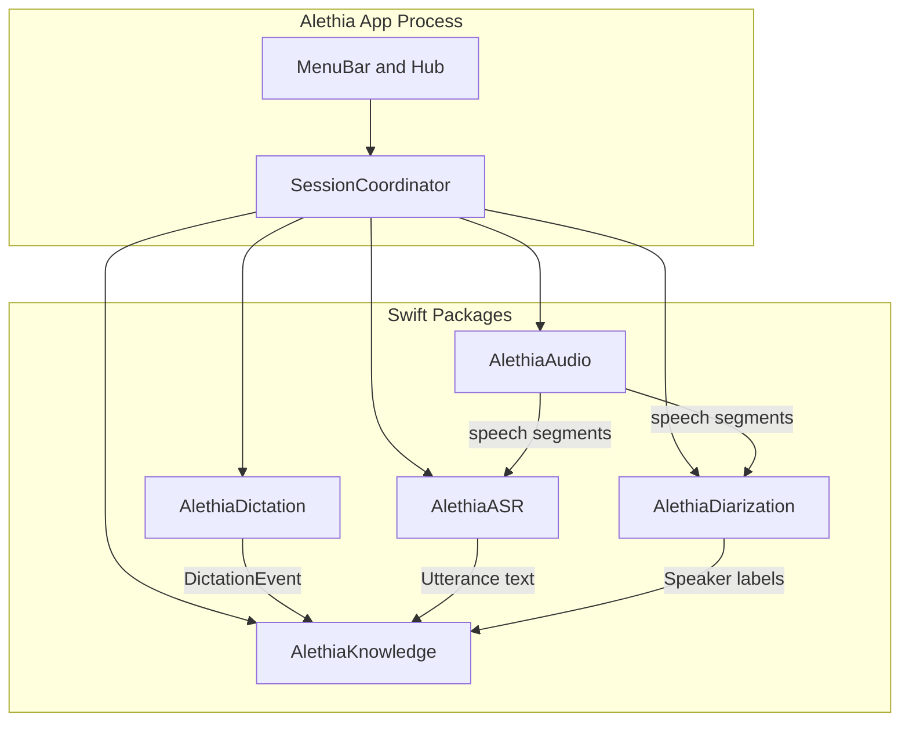

# Alethia Architecture

## Goals

1. Always-on ambient capture that only spends heavy compute on useful speech.
2. Push-to-talk dictation that types into any app and stores what was typed.
3. Persistent speaker identity that improves as the user names people.
4. Fully local — no audio or transcripts leave the device.

## Process topology

## Dual-mode audio policy

| Mode | Trigger | Capture | Downstream |
|------|---------|---------|------------|
| Ambient | User enables always-on | Mic (+ optional system audio) continuous | DSP → VAD → segmenter → ASR + diarization → SQLite |
| Dictation | Hotkey hold / toggle | Same engine, gated buffer | ASR → Accessibility paste → SQLite `dictations` |

Ambient never stops solely because dictation starts. Dictation takes a high-priority window on the same 16 kHz mono stream; ambient conversation state continues.

## Package responsibilities

### AlethiaCore
Domain types (`ConversationSession`, `Utterance`, `SpeakerProfile`, `DictationEvent`) and permission helpers.

### AlethiaAudio
- `AVAudioEngine` mic tap + ScreenCaptureKit system-audio mix
- Accelerate/vDSP front-end: RMS, noise gate, spectral flatness
- Silero VAD probabilities
- Conversation segmenter (open/close heuristics)

### AlethiaASR
whisper.cpp with Metal + Core ML. Consumes PCM segments; emits timestamped text.

### AlethiaDiarization
ECAPA-TDNN embeddings per utterance → agglomerative clustering within a session → cosine match against the persistent speaker gallery.

### AlethiaDictation
Carbon/CGEvent hotkey monitor, overlay waveform, Accessibility keystroke insertion, dictation artifact persistence via Knowledge.

### AlethiaKnowledge
SQLite schema + FTS5 search across sessions, utterances, and dictations. Speaker rename updates gallery + historical labels.

## Data model (summary)

- `speakers` — id, display_name, embedding blob, updated_at
- `sessions` — id, started_at, ended_at, source (ambient|mixed), title
- `utterances` — session_id, speaker_id, start_ms, end_ms, text
- `dictations` — id, created_at, text, target_bundle_id, session_id nullable
- `fts_documents` — FTS5 over utterance + dictation text

## Performance strategy

Signal processing first:

1. Cheap DSP rejects silence/noise at &lt;1% CPU.
2. Silero VAD confirms speech.
3. Only then buffer audio for whisper + ECAPA.
4. Prefer quantized `large-v3-turbo` and short context windows for near-real-time.

## Non-goals (v1)

Cloud sync, calendar briefs, Windows/iOS, Intel optimization, LLM note enhancement (local Ollama can come later on top of Knowledge search).
